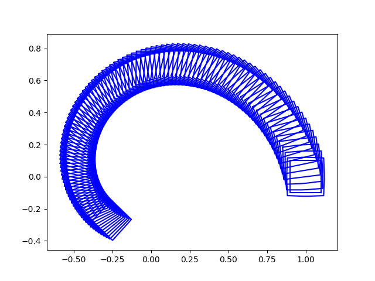

## Reachability of Linear Systems
The computation of the reachability of a dynamic system given the initial conditions is required for the verification of hybrid systems. For this, we will compute tje over-approximation of the reachable sets of uncertain linear systems. An important aspect of this, is the representation of the approximations of the reachable sets. There are multiple methods which use polytopes, oriented hyperrectangles, ellipsoids, orthogonal polyhedra. Here we are going to use orthogonal polyhedra, but using the analysis applied to zonotopes. I'm doing this because, even though the performance is better, implementing the algorithm using zonotopes is harder, but equivalent, so I consider this as a proof-of-concept implementation which could be translated to a zonotope representation with the appropiate methods to transform zonotope-orthogonal polyhedra.

## Approximation of Reachable Sets
Let's start with the following uncertain linear system;

$$ x'(t) = Ax(t) + u(t), ||u(t)|| \leq \mu $$

where A is a $n \times n$ matrix and $||.||$ is the infinity norm on $\mathbb{R}^n$. Given the initial values $I$, if the reachable set at a time t is $\Phi_t(I)$, then the reachable set in the interval $[\underline{t}, \overline{t}]$ can be defined by:

$$ R_{[\underline{t}, \overline{t}]}(I) =  \cup_{t \in [\underline{t}, \overline{t}]} \Phi_t(I)$$

To compute the over-approximation of the reachable set we can decompose $R_{[\underline{t}, \overline{t}]}(I)$ with a time step r.

$$ R_{[0, t]}(I) =  \cup_{i=0}^{i=N-1} R_{[ir, (i+1)r]}(I)$$

So we need to calculate the over approximation set $R_{[ir, (i+1)r]}(I)$. We have

$$ R_{[ir, (i+1)r]}(I) = \Phi_r(R_{[(i-1)r, ir]}(I))$$

## Approximation of $\Phi_r$
Let $y \in \Phi_r$, there is an input u such that

$$ y = e^{rA}x + \int^r_0e^{(r-s)A}u(s)ds$$

so

$$ ||y - e^{rA}x|| \leq \int^r_0e^{(r-s)||A||}\mu ds = \frac{e^{r||A||}-1}{||A||}\mu$$

We can define $\beta = \frac{e^{r||A||}-1}{||A||}\mu$, so $\Phi_r$ is an over approximation of $e^{rA}Z + \square(\beta_r)$

## Approximation of $R_{[0, r]}$

$$R_{[0, r]}(Z) \subseteq (\cup_{t \in [0, r]} e^{rA}Z) + \square(\beta_r)$$

## Mantaining the size of the polyhedra (zonotope)

Because we are doing a Minkowski sum in each iteration the dimension of the Zonotope or the number of vertices of the polyhedra, will keep increasing in each iteration. To avoid this, we are going to use a very simple methods (better methods exist, for example, in [1]). Every time that we have a polyhedraof more than 20 vertices, we are going to substitute it by the smallest parallelogram (the one that covers the polyhedra with the minimum area).

## Reachability Algorithm


```
#include <CGAL/minkowski_sum_2.h>
#include "bops_linear.h"
#include <CGAL/Exact_predicates_inexact_constructions_kernel.h>
#include <CGAL/convex_hull_2.h>
#include <CGAL/Convex_hull_traits_adapter_2.h>
#include <CGAL/property_map.h>
#include <CGAL/Line_2.h>
#include <CGAL/Cartesian.h>
#include <CGAL/Simple_cartesian.h>
#include <CGAL/Polygon_2.h>
#include <CGAL/random_convex_set_2.h>
#include <CGAL/min_quadrilateral_2.h>

#include <numeric>
#include <vector>
#include <set>
#include <list>
#include <iostream>
#include <fstream>

//#include <CGAL/Gmpzf.h>

#include "matrix_exponential.hpp"

class Matrix {
public:
	Matrix(int n, int m) {
		data_.resize(n);
		for (int i = 0; i < m; i++) data_[i].resize(m);
		n_ = n;
		m_ = m;
	}

	std::vector<double>& operator[](int i) { return data_[i]; }

	Matrix operator*(double x) const {
		Matrix a = *this;
		for (int i = 0; i < n_; i++) {
			for (int j = 0; j < m_; j++) {
				a[i][j] *= x;
			}
		}
		return a;
	}

	Polygon_2 operator*(const Polygon_2& a) const {
		Polygon_2 b;
		if (n_ != 2) return b;
		for (const auto& vertex : a) {
			const double& x = to_double(vertex.x().exact());
			const double& y = to_double(vertex.y().exact());
			b.push_back(Point_2(data_[0][0]*x + data_[0][1]*y, 
				data_[1][0] * x + data_[1][1] * y));
		}
		return b;
	}

	double MaxNorm() const {
		if (data_.empty() || data_[0].empty()) return 0.0;
		int n = data_.size();
		int m = data_[0].size();
		double res = data_[0][0];
		for (int i = 0; i < n; i++) {
			for (int j = 0; j < m; j++) {
				res = std::max(res, data_[i][j]);
			}
		}

		res = abs(data_[0][0]* data_[1][1] - data_[0][1] * data_[1][0]);

		return res;
	}

	Matrix Exponential() {
		int n = data_.size();

		double* a = new double[n * n];

		for (int i = 0; i < n; i++) {
			for (int j = 0; j < n; j++) {
				a[i * n + j] = data_[i][j];
			}
		}

		double* res = r8mat_expm1(n, a);

		Matrix res_matrix(n, n);
		for (int i = 0; i < n; i++) {
			for (int j = 0; j < n; j++) {
				res_matrix[i][j] = res[i*n + j];
			}
		}

		delete[] res;
		delete[] a;

		return res_matrix;
	}

private:
	std::vector<std::vector<double> > data_;
	int n_;
	int m_;
};

double Sup(const Polygon_2& initial_value) {
	double res = 0.0;
	for (const auto& vertex : initial_value) {
		const double& x = to_double(vertex.x().exact());
		const double& y = to_double(vertex.y().exact());
		res = std::max(res, sqrt(x * x + y * y));
	}
	return res;
}

Polygon_2 Multiply(const Polygon_2& a, double h) {
	double res = 0.0;
	Polygon_2 b;
	for (const auto& vertex : a) {
		const double& x = to_double(vertex.x().exact());
		const double& y = to_double(vertex.y().exact());
		b.push_back(Point_2(x*h, y*h));
	}
	return b;
}

Polygon_2 CreateHyperrectangle(double x) {
	Polygon_2   P;
	P.push_back(Point_2(x, -x));
	P.push_back(Point_2(x, x));
	P.push_back(Point_2(-x, x));
	P.push_back(Point_2(-x, -x));
	return P;
}

Polygon_2 MinkowskiSum(const Polygon_2& a, const Polygon_2& b) {
	return CGAL::minkowski_sum_2(a, b).outer_boundary();
}

const int MAX_VERTICES = 20;

CGAL::Point_2< CGAL::Cartesian<double> > ToPoint(CGAL::Point_2< CGAL::Epeck > p) {
	const double& x = to_double(p.x().exact());
	const double& y = to_double(p.y().exact());
	return CGAL::Point_2< CGAL::Cartesian<double> >(x, y);
}

Polygon_2 MinParalelogram(const Polygon_2& p) {
	Polygon_2 p_m;
	CGAL::minimum_enclosing_parallelogram_2(
		p.vertices_begin(), p.vertices_end(), std::back_inserter(p_m));
	return p_m;
}

Polygon_2 ReduceVertices(const Polygon_2& pol) {
	if (pol.size() < MAX_VERTICES) return pol;

	return MinParalelogram(pol);
}

std::vector< Polygon_2 > Reachability(const Polygon_2& initial_value, double t, 
	double delta_t, const Matrix& a, double mu) {
	int n = t / delta_t;

	double a_norm = a.MaxNorm();
	double alpha_r = (exp(delta_t * a_norm) - 1 - delta_t * a_norm) * Sup(initial_value);
	double beta_r = (exp(delta_t * a_norm) - 1) / a_norm * mu;

	Matrix a_exp = (a * delta_t).Exponential();

	Polygon_2 P0_1 = a_exp * initial_value;

	Matrix a_exp_2 = (a * -delta_t).Exponential();

	Polygon_2 P0_2 = a_exp_2 * initial_value;

	Polygon_2 P0 = MinkowskiSum(Multiply(P0_1, 0.5), Multiply(P0_2, 0.5));

	Polygon_2 Q0 = MinkowskiSum(P0, CreateHyperrectangle(alpha_r + beta_r));

	std::vector< Polygon_2 > res = { Q0 };

	Polygon_2 result = Q0;

	for (int i = 1; i < n; i++) {
		Q0 = ReduceVertices(Q0);

		P0 = a_exp * Q0;
		Q0 = MinkowskiSum(P0, CreateHyperrectangle(beta_r));

		res.push_back(Q0);
	}

	return res;
}
```

## Example

We are going to solve the system:

$$ A = 
\begin{pmatrix}
-1 & -4\\
4 & -1
\end{pmatrix}, \mu = 0.05 $$

with initial value $I = [0.9, 1.1] × [−0.1, 0.1]$.



## Zonotope

A Zonotope is a set such that

$$ Z = \{ x \in \mathbb{R}^n : x = c + \sum_{i=1}^{i=p}{x_i g_i}, -1 \leq x_i \leq 1  \} $$

where $c, g_i$ are vectors in $\mathbb{R}^n$ called the center and the generators. So Z is defined as $Z=(c, <g_1, g_2, ...>)$.

The Minkowski sum of two zonotopes can be computed as:

$$ Z_1 + Z_2 = (c_1 + c_2, <g_1, g_2, ..., h_1, h_2, ...>)$$

## Reduce Dimension Zonotope 1

The simplest method to compute the vertices of the Zonotope is to calculate all the possible $2^p$ combinations of vertices, and then calculate the convex hull of the vertices. This is computational expensive so it is worth to reduce the dimension of the zonotope.
The method created in [1] is to first sort all the generators by $||Norm_1(g_i) - Norm_{\inf}(g_i)||$ to merge all generators that are almost one dimensional, and then add all the rest of generators. The algorithm is implemented in the method:

```
	Zonotope ReduceVerticesZonotope(const Zonotope& zonotope) {
		if (zonotope.Generators().size() < MAX_VERTICES) return zonotope;

		std::vector<std::vector<double> > generators;

		std::vector<std::vector<double> > old_generators = zonotope.Generators();

		std::sort(std::begin(old_generators),
			std::end(old_generators),
			[](const std::vector<double>& l, const std::vector<double>& r) {
			return L1Norm(l) - LInfNorm(l) < 
				L1Norm(r) - LInfNorm(r);
		});

		int d = old_generators[0].size();
		int p = old_generators.size();
		int r;
		if (d == 2) {
			r = 4;
		}
		else {
			r = 2;
		}
		int m = p - d * (r - 1);
		for (int i = 0; i < d; i++) {
			std::vector<double> v(d, 0.0);
			for (int j = 0; j < m; j++) {
				v[i] += abs(old_generators[j][i]);
			}
			generators.push_back(v);
		}

		for (int i = m; i < p; i++) {
			generators.push_back(old_generators[i]);
		}
		
		return Zonotope(zonotope.Center(), generators);
	}
```

## Equations of the Car

$$ \dot{x} = \dot{x_1} = s \cdot cos(x_3 + x_5)$$
$$ \dot{y} = \dot{x_2} = s \cdot sin(x_3 + x_5)$$

$$ \dot{\theta} = x_4$$

$$ \ddot{\theta} = \dot{x_4} = -\frac{c_1}{s}x_4 - c_2x_5 + c_3u$$

$$ \dot{\phi} = \dot{x_5} = (-1 - \frac{c_4}{s^2})x_4 - \frac{c_5}{s}x_5 + \frac{c_6}{s}u$$

## Linearization of the Equations

The previous system of equations is non-linear, but we need to use a linear system to solve it and so we can separate the computation of the reachable sets of the state and input dependent part.

The dynamics of the autonomous car is given by:

$$ \dot{x} = f(x, u)$$

$$ ||u_{\inf}|| < \delta $$

We can approximate this by a linear system by keeping the first order of the Taylor expansion:

$$ \dot{x} \approx f(x_i^*,u^*) + \frac{\partial f(x, u)}{\partial x}\bigg\rvert_{x=x_i^*,u=u^*} \Delta x + \frac{\partial f(x, u)}{\partial u}\bigg\rvert_{x=x_i^*,u=u^*} \Delta u  + ...$$

where we can define:

$$ A_i = \frac{\partial f(x, u)}{\partial x}\bigg\rvert_{x=x_i^*,u=u^*}$$

$$B_i = \frac{\partial f(x, u)}{\partial u}\bigg\rvert_{x=x_i^*,u=u^*}$$

and $x_i^*=mid(X_i), u^*=0$

## Reachable Set Computations

There are two types of reachable sets, the state-dependent and input-dependent sets.

| Reachable set        | x(0)           | $f(x^*, u^*)$  | u |
| ------------- |:-------------:| -----:| -----:|
| R      | $\neq 0$ | $\neq 0$ | $\neq 0$ |
| $\bar{R}$      | $= 0$      |   $= 0$ | $\neq 0$ |
| $\hat{R}$ | $\neq 0$      |    $= 0$ | $= 0$ |
| $\check{R}$ | $= 0$      |    $\neq 0$ | $= 0$ |

### State dependent Reachable set
$\hat{R}$ is computed with the method for linear systems described above.

$\check{R}$ is computed with:

$$ \check{R}_i(T) = \int_0^T{a^{A_i(t-\tau)}d\tau f(x_i^*, u*)} = A_i^{-1}(e^{A_i T} - I)f(x_i^*, u*)$$

Ans $\check{R}([0, T])$ is approcimated by:

$$ \check{R}([0, T]) = \frac{t}{T} \check{R}_i(T) + \square (\eta_i)$$

$$ \eta_i = || A_i^{-1}[e^{A_i T} - I - A_iT - 0.375(A_iT)^2]f(x_i^*, u*)||_\infin$$

### Input dependent Reachable set
$\bar{R}$ is computed by using u as a disturbance.

$$ \bar{R}(kT) = A_i^{-1}(e^{A_iT} - I)B_iu(k) + A_i^{-2}(e^{A_iT} - I - A_iT)B_i\dot{u}(k)$$

## Separation of Linear System

If we use the equation as we have defined them earlier, we will notice the the matrix A is non-invertible, but we are making use of the inverse in the calculation of the reachable sets. 

To solve this, and considering the equations are coupled (($x_4, x_5$) -> ($x_3$)-> ($x_1, x_2$)), we can solve the systems separately and create three Marokov Chains.